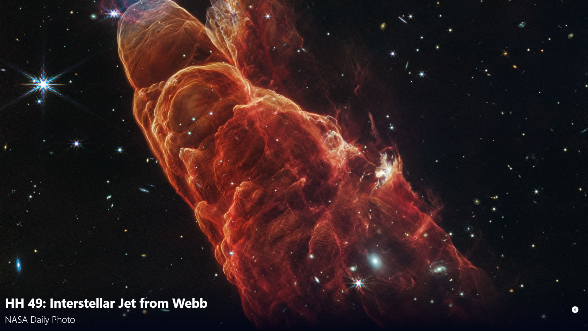
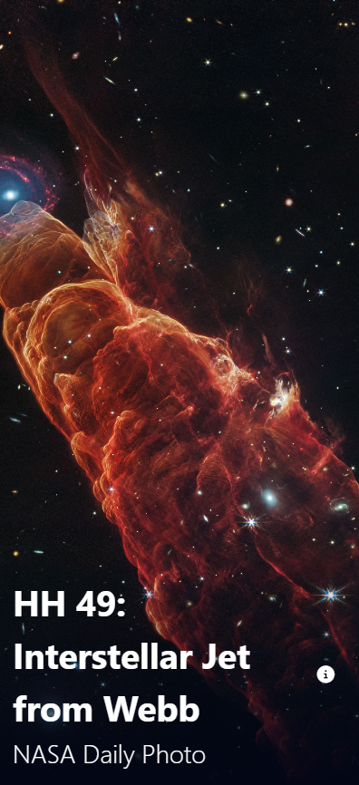

# NASA Daily Photo

The **NASA Daily Photo** project is a web application that fetches and displays the Astronomy Picture of the Day (APOD) from NASA's API. This project demonstrates the use of **React**, **HTML**, **CSS**, and **JavaScript** to create a responsive and interactive user experience.

---

## 🚀 Features

- **Daily Photo Display**: Fetches and displays the Astronomy Picture of the Day from NASA's API.
- **Dynamic Sidebar**: View detailed information about the photo in a slide-in sidebar.
- **Responsive Design**: Optimized for both desktop and mobile devices.
- **Local Storage**: Caches API data to reduce redundant network requests.

---

## 📂 Project Structure

The project is structured as follows:

```bash
NASA-Daily-Photo/
├── .gitignore              # Git ignore file
├── eslint.config.js        # ESLint configuration
├── index.html              # Main HTML file
├── LICENSE                 # License file
├── package.json            # npm configuration file
├── README.md               # Project documentation
├── vite.config.js          # Vite configuration
├── public/                 # Static files
│   ├── mars.png            # Mars image
│   ├── nasa.png            # NASA logo
│   └── screenshots/        # Screenshots of the project
└── src/                    # Main application source code
 ├── App.jsx             # Main application component
 ├── index.css           # Global CSS styles
 ├── main.jsx            # Application entry point
 ├── assets/             # Additional assets
 │   └── react.svg       # React logo
 └── components/         # Folder for components
     ├── Footer.jsx      # Footer component
     ├── Main.jsx        # Main image display component
     └── SideBar.jsx     # Sidebar component
```

---

## 🛠️ Technologies Used

- **React**: A JavaScript library for building user interfaces.
- **Vite**: A fast build tool and development server.
- **CSS**: For styling the application.
- **LocalStorage**: For caching API data in the browser.
- **Font Awesome**: For modern and intuitive icons.

---

## 🌟 Key Functionalities

1. **Fetch Daily Photo**:

   - Retrieves the Astronomy Picture of the Day from NASA's API.

2. **View Photo Details**:

   - Displays additional information like the title, date, and explanation in a sidebar.

3. **Responsive Design**:

   - Ensures a seamless experience across devices.

4. **Persistent Caching**:

   - Caches API data in the browser's local storage to improve performance.

---

## 📸 Screenshots

### Desktop View



### Mobile View



---

## ⚙️ Installation and Usage

1. Clone the repository:
   ```bash
   git clone https://github.com/Xelo04/NASA-Daily-Photo
   cd NASA-Daily-Photo
   ```
2. Install dependencies:
   ```bash
   npm install
   ```
3. Start the development server:
   ```bash
   npm run dev
   ```
4. Open the app in your browser at http://localhost:5173.

---

## 🤝 Contributing

Contributions are welcome! If you have suggestions or improvements, feel free to fork the repository and submit a pull request.

---

## 📜 License

This project is under the MIT License - see the [LICENSE](./LICENSE) file for details.
